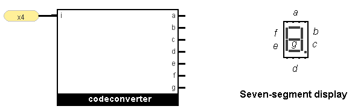
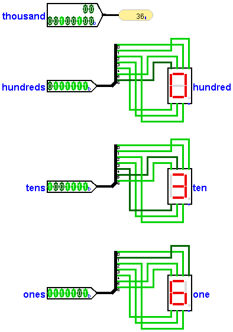

:Author: Justin Perona
:Copyright: © 2020 Justin Perona
:License: CC BY-NC 4.0

========================
ECS 154A - Lab 1 WQ 2020
========================

.. contents::
  :local:

Logistics
---------

Submission
~~~~~~~~~~

Due by 20:00 on Monday, 2020-01-20.

Turn in for the Logisim portion is on Gradescope.
Submit the specified .circ files for each problem.
The person submitting should specify their partner's name (if necessary) during the submission process.

Turn in for the survey is on Canvas.
Each person needs to submit a survey, even if they worked with a partner.
More information on the survey is at the end of this document.

Logisim Evolution
~~~~~~~~~~~~~~~~~

We will be using v2.15.0 of `Logisim Evolution`_ for the majority of the quarter.
You can download it here_.
**You must use v2.15.0 for the autograder to run correctly!**
Save yourself some frustration and download it from the link above; don't download it anywhere else.

Logisim Evolution is distributed via a JAR file.
JAR files need a Java Runtime Environment (JRE) available to run.
Here's recommendations for a JRE for the major operating systems:

* On Linux, you should be able to find *openjdk11-jre* or something similar via your package manager.

  * The CSIF has OpenJDK 11 installed already and should work out of the box.
  * You'll need to forward X if you want to SSH into CSIF machines and run Logisim Evolution.

* On Windows and OS X, I suggest OpenJDK 11 LTS from AdoptOpenJDK_.

  * One TA has reported that you'll need to adjust your security settings in your options to run the JAR file.

Matthew Farrens has a Logisim introduction available on `his website`_; read sections 2 and 3.
Note that this was written for the original Logisim, so some things might look a bit different, but the basics should be the same.
Discussions in the first week will also give a short introduction to Logisim Evolution and how to implement functions.
I'd recommend that you download it and test it out before your first discussion so that you can follow along on the tutorial.

.. _`Logisim Evolution`: https://github.com/reds-heig/logisim-evolution
.. _here: https://github.com/reds-heig/logisim-evolution/releases/tag/v2.15.0
.. _AdoptOpenJDK: https://adoptopenjdk.net/
.. _`his website`: http://american.cs.ucdavis.edu/academic/ecs154a/postscript/logisim-tutorial.pdf

Grading
~~~~~~~

When you submit your .circ files to Gradescope, an autograder will run each of your circuit files together with my grading circuit for that problem.
If your output matches the expected output for a given problem, you get full credit, otherwise you get a 0 for that problem.
You have unlimited submissions; test as many times as you like.

The autograder expects specific file names for each part, as well as main circuit names.
In addition, the autograder expects specific input/output pin names and that the pins are in certain places.
We will provide you with base circuits for each problem (see the *base/* subfolder) that are set up correctly.
**Don't do any of the following things:**

* modify the file name
* modify the base circuit name
* modify the names of the pins already there
* move any of the pins already there
* delete any of the pins already there
* add extra pins

If you do, your circuit might fail to run, error out, or give the wrong results.
If it does, you'll get a 0.

Debugging
~~~~~~~~~

The *Test Vector* feature in Logisim Evolution allows you to test your circuit against the expected output.
Test vector files with expected output for each problem have been provided for you in the *vector/* subdirectory.
You can read more about the Test Vector feature and how to use it in the Logisim Evolution User's Guide:

1. Click on *Help* in the top menu.
2. Click on *User's Guide*.
3. Under *Guide to Being a Logisim User*, click on *Command-line verification*.
4. On the page that comes up, click on *Test Vectors* near the top.

If the test vector fails, then your circuit will fail the autograder as well.
That said, *it's possible to pass every test case in the vector but fail the autograder!*
If this ends up happening to you, the most likely culprits are anything listed above in the Grading_ section.
Doing any of these causes your submission to interact differently with the autograder's grading mechanism.

Constraints
~~~~~~~~~~~

For these problems, you must use designs relying on only basic gates (NOT, AND, OR, NAND, NOR, XOR, XNOR) and the Logisim wiring library, unless specified otherwise.
Violating specified constraints will result in a 0 on the problem in question.
While the autograder may give you credit even if you violate a constraint, we will check submissions after the due date and update grades appropriately.

Logisim Problems [95]
---------------------

1. Quick introduction to Logisim [10]
~~~~~~~~~~~~~~~~~~~~~~~~~~~~~~~~~~~~~

* Submission file for this part: *1.circ*
* Main circuit name: *introduction*
* Input pin(s): *A* [1], *B* [1], *C* [1], *D* [1]
* Output pin(s): *f* [1], *g* [1]

This problem is designed to get you used to Logisim Evolution and how submitting your circuit works on Gradescope.
I *highly recommend* submitting your answer to Gradescope after you finish this part to test that you're doing things correctly.
See the Grading_ section above for more information if you're encountering any problems.

Create two circuits using gates for the following functions.

    f(A, B, C, D) = AC + B!D + !C!D

    g(A, B, C, D) = !A!D + A!BD + B!CD + ABCD

After opening the base circuit for this problem, you will be greeted by some input and output pins and nothing else.
The basic gates are on the top toolbar, or you can open the Gates library in the left sidebar.

I highly recommend using tunnels, and continuing to use them throughout the rest of the labs.
Tunnels make your circuit cleaner and allows for easier debugging; they allow you to move a value from one part of the circuit to another without having to drag a wire all the way across.
You can create tunnels for all the inputs (ABCD) and their complements.
Instead of hooking up the inputs directly to the gates, you can hook up duplicates of the tunnels instead.

Once you're finished with a circuit and want to test it manually, you can use the hand tool and click on the input pins to change their values, which will propagate to the rest of the circuit.
You can reset the simulation back to the start with Ctrl-R to test again after you make changes.
You can also use the Test Vector feature to automatically test your circuit; see the Debugging_ section above.

2. Minterm [10]
~~~~~~~~~~~~~~~

* Submission file for this part: *2.circ*
* Main circuit name: *minterm*
* Input pin(s): *fourbitinput* [4]
* Output pin(s): *h* [1]

Implement the minterm m_14 for a 4 bit input.
You will need to learn how to use a splitter to access the individual bits.

You may not use OR nor NOR gates for this problem.

3. Maxterm [10]
~~~~~~~~~~~~~~~

* Submission file for this part: *3.circ*
* Main circuit name: *maxterm*
* Input pin(s): *fourbitinput* [4]
* Output pin(s): *j* [1]

Implement the maxterm M_6 for a 4 bit input.

You may not use AND nor NAND gates for this problem.

4. Karnaugh map [10]
~~~~~~~~~~~~~~~~~~~~

* Submission file for this part: *4.circ*
* Main circuit name: *karnaugh*
* Input pin(s): *fourbitinput* [4]
* Output pin(s): *k* [1]

Derive and implement a minimum sum-of-products expression for the following function:

    k(fourbitinput) = m0 + m2 + m4 + m6 + m8 + m10 + m13 + m14

m stands for minterm.

Note your SOP expression must be minimal and utilize don't cares, if any.
If it is not, and you brute-force the problem, you will lose points.

5. Single-digit seven-segment display [35]
~~~~~~~~~~~~~~~~~~~~~~~~~~~~~~~~~~~~~~~~~~

* Submission file for this part: *5.circ*
* Main circuit name: *singledigit*
* Input pin(s): *i* [4]
* Output pin(s): *a* [1], *b* [1], *c* [1], *d* [1], *e* [1], *f* [1], *g* [1]

Given the following binary-coded-decimal to seven-segment display code converter, derive minimal sum-of-products expressions for the outputs *a*, *b*, *c*, *d*, *e*, *f*, and *g* of the seven-segment display.
Implement the resulting circuits.

====== ====== ====== ====== = === === === === === === ===
**i3** **i2** **i1** **i0** | *a* *b* *c* *d* *e* *f* *g*
0      0      0      0      | 1   1   1   1   1   1   0
0      0      0      1      | 0   1   1   0   0   0   0
0      0      1      0      | 1   1   0   1   1   0   1
0      0      1      1      | 1   1   1   1   0   0   1
0      1      0      0      | 0   1   1   0   0   1   1
0      1      0      1      | 1   0   1   1   0   1   1
0      1      1      0      | 1   0   1   1   1   1   1
0      1      1      1      | 1   1   1   0   0   0   0
1      0      0      0      | 1   1   1   1   1   1   1
1      0      0      1      | 1   1   1   1   0   1   1
====== ====== ====== ====== = === === === === === === ===

The 3rd and most significant bit of the input *i* corresponds to **i3** on the table.
Similarly, the 0th and least significant bit of the input *i* corresponds to **i0** on the table.
We will use this naming system throughout the class.

Note your SOP expression must be minimal and utilize don't cares, if any.
If it is not, and you brute-force the problem, you will lose points.

Testing this problem is best done manually by attaching the relevant inputs to the *7-Segment Display* module from the Input/Output library of Logisim.
Feel free to leave it inside your circuit if you want before submission; it won't affect the testing.

6. 4-to-1 multiplexor [20]
~~~~~~~~~~~~~~~~~~~~~~~~~~

* Submission file for this part: *6.circ*
* Main circuit name: *multiplexor*
* Input pin(s): *inputzero* [3], *inputone* [3], *inputtwo* [3], *inputthree* [3], *selector* [2]
* Output pin(s): *muxoutput* [3]

Create a 4-to-1 multiplexer that uses three data bits.
The *selector* input chooses between which of the four *input* pins to output to *muxoutput*.
Hint: the lecture notes show how to make a 4-to-1 multiplexor with one data bit, but you'll need to figure out what to modify to support more data bits.

You may not use MUXes for this problem as it defeats the purpose of the problem.

Survey [5]
----------

For every lab, there will be an associated post-lab survey worth 5% of the grade.
Surveys are graded on completion; your answers do not affect your grade.
This survey is going to ask you about how you felt about the assignment and how much time you spent on it.
Everybody needs to submit a survey response individually.

There's no late penalty on the survey portion.
As long as you submit by the late submission deadline, you'll get full credit.

You can find the `survey for this lab`_ on Canvas.

.. _`survey for this lab`: https://canvas.ucdavis.edu/courses/424855/quizzes/54371

Extra credit: Triple-digit display [15]
---------------------------------------

* Submission file for this part: *extracredit.circ*
* Main circuit name: *tripledigit*
* Input pin(s): *thousand* [10]
* Output pin(s): *hundreds* [7], *tens* [7], *ones* [7]

This extra credit problem builds upon problem 5.
Using your circuits from problem 5, build a triple-digit display that can display numbers between 0 and 999.
The input number to display is provided in *thousand*.
Note that *thousand* is 10 bits and thus has a maximum of 1024; numbers higher than 999 won't be tested so you may ignore them.

For the output pins, concatenate your values for *a*, *b*, *c*, *d*, *e*, *f*, and *g* in that order for each relevant digit.
Thus, the 6th and most significant bit should be your *a* output for that digit, while the 0th and least significant bit should be your *g* output for that digit.

The image below shows an example of how the circuit works for an input value of 36.

You may use anything in the Logisim Arithmetic library for this problem.
Testing this problem is best done manually by attaching relevant inputs to *7-Segment Display* modules from the Input/Output library of Logisim.
Feel free to leave them inside your circuit if you want before submission; they won't affect the testing.
